# git(GitHub 編)

[README](./README.md)

---

## [GitHub](https://github.com/)

- 無料プランでも非公開のプライベートリポジトリが作成可能。
  - 大規模なバイナリは不可。
  - 特に、**動画ファイルや`AI`のモデル等を誤って`push`するケースが多いので注意すること。**
  - 一旦大容量ファイルが`push`されると、`pull`やクローンする場合にかなりの時間を消費してしまう。
  - [`.gitignore`](https://zenn.dev/fumi_mizu/articles/6020666fedea10)を上手く使うこと。
    - [ROS.gitignore](https://github.com/github/gitignore/blob/main/ROS.gitignore)

## **!注意事項!**

- 非公開リポジトリとはいえネットワーク上に存在するものである、ということを忘れないようにすること。
- 個人情報の記載は厳禁。漏洩の可能性はゼロではない。
  - 学生プロジェクトのソフトは公開する場合もある。
- コミットオーサーの名前・・・フルネームは不可
- コミットオーサーのメールアドレス・・・Githubアカウント作成時にメールアドレス非公開にしていれば`123321+username@users.noreply.github.com`のようなメールアドレスを生成してくれるので、これを使う。

以上に注意して、[GitHub](https://github.com/)でアカウントを作成し、自分のユーザ名を把握しておくこと。

## Linuxでのgit環境構築

### SSH鍵の生成

`git`を使ってリモートリポジトリに変更を加えるとき、サーバへの`ssh`接続を経由することになる。
リモートコンピュータへの`ssh`接続時はユーザ名やパスワードを入力することがあるが、`GitHub`は暗号鍵を使った接続しか受け付けていないので以下の手順で鍵の生成を行う。

なお、この手順は普通の`ssh`接続でも利用可能な一般的な方法である。単に接続先のコンピュータが`GitHub`のサーバ`github.com`で、接続するユーザ名が`git`というだけである。

ターミナルで次のコマンドを入力する。

```shell
cd
pwd
# 実行結果
/home/ユーザ名 # ホームディレクトリにいるはず。Dockerの開発環境の場合は /home/ubuntu
```

次のコマンドで`.ssh`ディレクトリがあるかどうかを確認する。先頭の`.（ドット）`を忘れないように注意すること。

```shell
ls -a|grep .ssh
# 実行結果
.ssh/ # 存在していればOK。
# 無ければ作成する。
# mkdir .ssh
```

`.ssh`ディレクトリに移動して、鍵を生成する。`-f`オプションで指定する鍵の名前は分かりやすい任意の名前を使ってよい。

```shell
cd .ssh
pwd
# 実行結果
/home/ユーザ名/.ssh

ssh-keygen -t rsa -f github_rsa -N ""
# -t 生成する鍵の暗号化方式。
# -f 生成するファイルの名前。
# -N パスフレーズを指定する。""でパスフレーズを省略できる。
# 実行結果
Generating public/private rsa key pair.
Your identification has been saved in github_rsa
Your public key has been saved in github_rsa.pub
The key fingerprint is:
SHA256:************
The key's randomart image is:
+---[RSA 3072]----+
|                 |
# 省略
|                 |
+----[SHA256]-----+

ls
# 実行結果
github_rsa  github_rsa.pub
```

生成した鍵を使用するように設定ファイルを記述する。

```shell
pwd
# 実行結果
/home/ユーザ名/.ssh # 作業ディレクトリを確認する。異なっている場合は cd ~/.ssh で移動する。
# 好きなテキストエディタで編集する
emacs ./config -nw
```

開いた`config`ファイルに次のテキストを追記して上書き保存する。
`emacs`の場合は`Ctrl+X`を押してから`Ctrl+S`で保存し、`Ctrl+X`を押してから`Ctrl+C`で終了する。

```text
Host github.com
    User git
    Port 22
    HostName github.com
    identityFile ~/.ssh/github_rsa
    TCPKeepAlive yes
    IdentitiesOnly yes
```

`config`ファイルには複数の接続先情報を記述できるので、異なった名前の鍵を生成し上記のような情報を追記して行けば複数の`git`ホスティングサービスを扱うことができる。

### コミット時の名前とメールアドレスの設定

ターミナルで次のコマンドを実行する。

```shell
git config --global user.name "コミット時に登録される名前" # 例： "CommitAuthor" 
git config --global user.email "123321+username@users.noreply.github.com" # GitHubでユーザ登録したときに得られるメールアドレス
git config --global core.editor "emacs -nw"  # コミットメッセージの編集ツールを指定。使い慣れたエディタを設定してよい。
cd # ホームディレクトリに戻る。
cat .gitconfig
# 実行結果
[user]
        email = 123321+username@users.noreply.github.com
        name = コミット時に登録される名前
```

## Windowsでのgit環境構築

ここでは`VSCode`を`git`クライアントとして利用する方法を紹介する。

### ソフトをインストール

- [git for windows](https://gitforwindows.org/)
- [VSCode](https://azure.microsoft.com/ja-jp/products/visual-studio-code/)

### SSH鍵の生成

`git bash`を起動する。

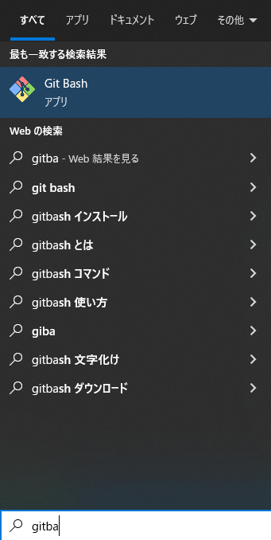

`pwd`コマンドで作業ディレクトリを確認する。通常は`/c/Users/ユーザ名`が作業ディレクトリになっている。

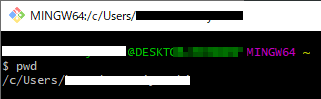

もしそうでなければ`cd`コマンドを実行して`pwd`で作業ディレクトリを確認する。

```shell
cd
pwd
# 実行結果
/c/Users/ユーザ名
```

次のコマンドで`.ssh`ディレクトリがあるかどうかを確認する。先頭の`.（ドット）`を忘れないように注意すること。

```shell
ls -a|grep .ssh
# 実行結果
.ssh/ # 存在していればOK。
# 無ければ作成する。
# mkdir .ssh
```

`.ssh`ディレクトリに移動して、鍵を生成する。`-f`オプションで指定する鍵の名前は分かりやすい任意の名前を使ってよい。

```shell
cd .ssh
pwd
# 実行結果
/c/Users/ユーザ名/.ssh

ssh-keygen -t rsa -f github_rsa -N ""
# -t 生成する鍵の暗号化方式。
# -f 生成するファイルの名前。
# -N パスフレーズを指定する。""でパスフレーズを省略できる。
# 実行結果
Generating public/private rsa key pair.
Your identification has been saved in github_rsa
Your public key has been saved in github_rsa.pub
The key fingerprint is:
SHA256:************
The key's randomart image is:
+---[RSA 3072]----+
|                 |
# 省略
|                 |
+----[SHA256]-----+

ls
# 実行結果
github_rsa  github_rsa.pub
```

生成した鍵を使用するように設定ファイルを記述する。

```shell
pwd
# 実行結果
/c/Users/ユーザ名/.ssh # 作業ディレクトリを確認する。異なっている場合は cd ~/.ssh で移動する。
# メモ帳で編集する
notepad.exe ./config
```

`Windows`標準のメモ帳が起動する。`config`ファイルが存在しない場合はファイル生成するかどうかの確認ダイアログが開くので、作成する。

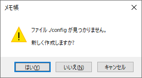

開いた`config`ファイルに次のテキストを追記して上書き保存する。

```text
Host github.com
    User git
    Port 22
    HostName github.com
    identityFile ~/.ssh/github_rsa
    TCPKeepAlive yes
    IdentitiesOnly yes
```

`config`ファイルには複数の接続先情報を記述できるので、異なった名前の鍵を生成し上記のような情報を追記して行けば複数の`git`ホスティングサービスを扱うことができる。

### コミット時の名前とメールアドレスの設定

`git bash`で次のコマンドを実行する。

```shell
git config --global user.name "コミット時に登録される名前" # 例： "CommitAuthor" 
git config --global user.email "123321+username@users.noreply.github.com" # GitHubでユーザ登録したときに得られるメールアドレス
cd
cat .gitconfig
# 実行結果
[user]
        email = 123321+username@users.noreply.github.com
        name = コミット時に登録される名前
```

## 公開鍵をGitHubに登録する（Windows,Linux共通）

[GitHub](https://github.com/)から`Sign in`しておく。
なお、`Repositories`タブから開発中のリポジトリ一覧を見ることができる。

[SSH and GPG keys](https://github.com/settings/ssh)を開いて`New SSH key`を押す。

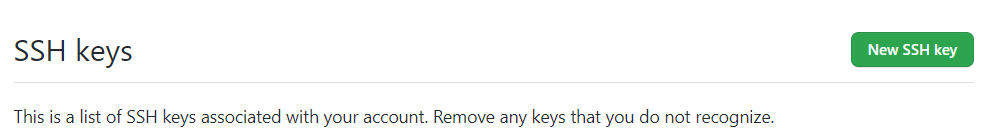

クリップボードに公開鍵のテキストをコピーする。どんな方法でもよい。

```shell
cat ~/.ssh/github_rsa.pub # ファイル名は ssh-keygen の f オプションで指定したもの＋拡張子 pub。
# 実行結果
ssh-rsa ********** ???@?????? #途中省略。表示内容をコピーする。
```

`GitHub`の`SSH keys / Add new`画面で`Title`に任意の名前を入力し、`Key`のテキストボックスにペースト（右クリック貼り付け、もしくは`Ctrl+V`）する。  
次のように先頭が`ssh-rsa`で始まる長い文字列がペーストされる。全く異なった文字列がペーストされた場合は前述のコピーからやり直すこと。

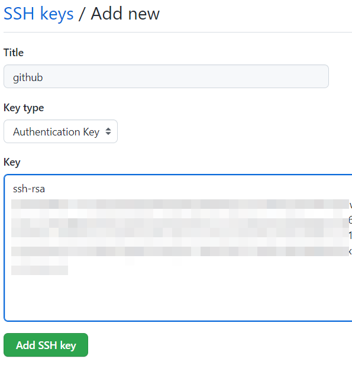

ペーストが済んだら`Add SSH key`を押す。[SSH keys](https://github.com/settings/ssh)の画面に新しい`SSH`鍵が追加される。

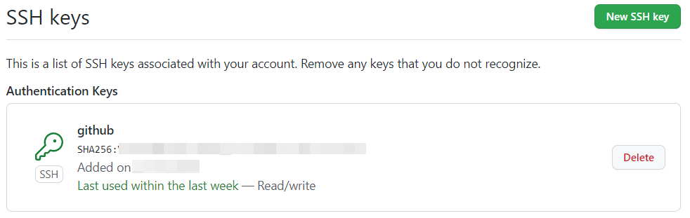

鍵を無効にしたい場合は`Delete`ボタンを押せばよい。

### SSH接続を確認する（Windows,Linux共通）

`git bash`もしくは`Linux`ターミナルで次のコマンドを実行し、以下の結果が出れば成功している。

```shell
ssh -T git@github.com
# The authenticity of host 'github.com (XXX.XXX.XXX.XXX)' can't be established.
# ECDSA key fingerprint is SHA256:XXXXXXXXXXXXXXXXXXXXXXXXXXXXXXXXXX.
# Are you sure you want to continue connecting (yes/no/[fingerprint])?
# 初回接続時はこのような質問を受ける場合がある。yes と入力して Enter キーを押す。
# 実行結果
Hi ユーザ名! You've successfully authenticated, but GitHub does not provide shell access.
```

## リモートリポジトリをクローンする

`Web`ブラウザでクローンしたいリポジトリを開き、`Code`ボタンを押して`SSH`をクリックし`git@`で始まる`URL`をコピーしておく。

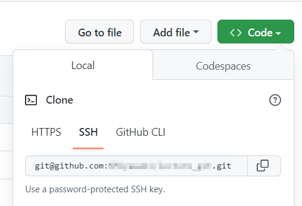

**！注意！ `git@`で始まる`URL`は自分が開発に関わるリポジトリ。そうではなく`github`で公開されている`public`なリポジトリの場合は`HTTPS`を選ぶこと。その場合は当然通常の方法では自分のコードをリモートに反映させることはできない。**

`git bash`もしくは`Linux`のターミナルで以下のコマンドを実行する。

```shell
cd ~/ros2_ws/src # リポジトリを配置したいディレクトリに移動する。ROS2開発の場合、大抵はこの場所。
git clone git@github.com:ユーザ名/リポジトリ名.git
```

## プル

プログラムを編集する前は常に他人の変更を取り込む（プルする）こと。
無用な競合を避けることができる。

```shell
cd ~/ros2_ws/src/リポジトリ # リポジトリのディレクトリに移動する。
git pull
```

## コミットとプッシュ

プログラムの編集が済み、問題なくコンパイルや実行ができるなら、変更をローカルリポジトリにコミットしリモートリポジトリにプッシュする。

```shell
cd ~/ros2_ws/src/リポジトリ # リポジトリのディレクトリに移動する。
# git add ファイル名 # 一部の変更をコミットする場合。
git add --all # 全部の変更をコミットする場合
git commit
# .gitconfig で指定したエディタが起動するので、コミットメッセージを書く。
# 日本語の簡単なメッセージでよい。以下は参考URL。
# https://gist.github.com/mono0926/e6ffd032c384ee4c1cef5a2aa4f778d7
# 編集を終えたら emacs の場合は `Ctrl+X,Ctrl+S`,`Ctrl+X,Ctrl+C`で編集を終える。
git push
```

## コミット用のシェルスクリプトを作成する（ロボット搭載PCの場合）

共有で使用している`PC`のリポジトリを編集してコミットする場合、そのままでは誰がコミットしたか分からなくなるため、次のようなスクリプトをホームディレクトリに作成してコミットする。

```shell
cd
emacs commit_c15999.sh # 自分の学番など。
```

内容は次の通り。`github`のユーザ名とメールアドレス（`github`から得られるダミーのアドレス）を指定する。

```text
#!/bin/bash
git commit --author='ユーザ名 <XXXX@YYYY.com>'
```

実行権限をつける。

```shell
chmod u+x ~/commit_c15999.sh
```

`git add`までは前述の通りで、`git commit`の代わりに`~/commit_c15999.sh`とすればよい。

## その他の操作

ローカルリポジトリの状態を確認する。

```shell
git status
# 実行結果
# この例ではファイル変更があったことを示している。
On branch main
Your branch is up to date with 'origin/main'.

Changes not staged for commit:
  (use "git add <file>..." to update what will be committed)
  (use "git restore <file>..." to discard changes in working directory)
        modified:   README.md

no changes added to commit (use "git add" and/or "git commit -a")
```

```shell
git log
# 実行結果
Author: Sample <XXXXXXXXXXX@users.noreply.github.com>
Date:   Wed Aug 28 15:37:58 2024 +0900

    add: comment
# 次のようにすると最後のコミットログだけを見ることができる。
# git log -n 1
```

ブランチの作成。

```shell
git checkout -b ブランチ名
```

作成したブランチをプッシュする。

```shell
git push -u origin ブランチ名
```

既存のリモートブランチのチェックアウト

```shell
git fetch
git checkout -b ブランチ名 origin/ブランチ名
git pull
```

ブランチ間の移動。

```shell
git checkout ブランチ名
```

ブランチ一覧を見る。

```shell
git branch
# 実行結果
  devel
* main # * があるのが現在作業中のブランチ
```

リモートも含めてブランチ一覧を見る。

```shell
git branch --all
  devel
* main
  remotes/origin/HEAD -> origin/main
  remotes/origin/devel
  remotes/origin/main
  remotes/origin/stitch_map # ローカルにはないがリモートにはあるブランチ
```

現在のローカルの変更を全て破棄する。

```shell
# コミットしていない変更を破棄する。
git reset --hard
# ローカルのコミットも破棄して、リモートに完全一致させる。
git reset --hard origin/ブランチ名
```

## VSCodeでリモートリポジトリをクローンする（参考・Windows）

`VSCode`を起動し、次の拡張機能をインストールする。

- GitLense
- Git Graph

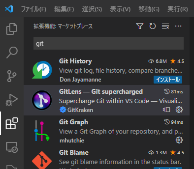

`Web`ブラウザでクローンしたいリポジトリを開き、`Code`ボタンを押して`SSH`をクリックし`git@`で始まる`URL`をコピーしておく。


`VSCode`で`Ctrl+Shift+P`を押しコマンドパレットを開いて`Git: Clone`と入力し`Enter`を押す。

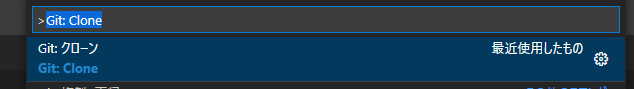

`git@`で始まる`URL`をペーストして`Enter`キーを押す。

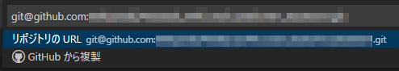

ローカルリポジトリの保存先選択ダイアログが出るので、作業用のフォルダを指定する。

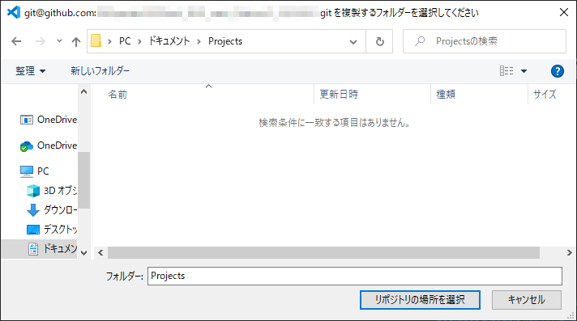

「クローンしたリポジトリを開きますか」と聞かれるので「開く」を押し、ファイルを確認する。

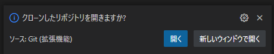

ソースコードの編集等が終わったら`VSCode`を終了する。作業再開時はフォルダを開けばよい。

---

[README](./README.md)
