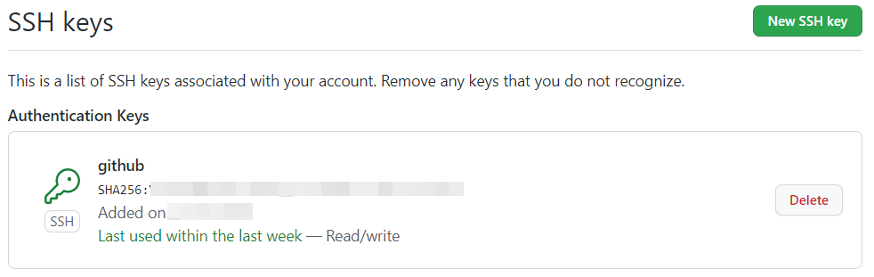
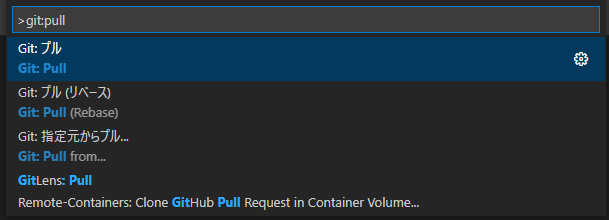

# git(GitHub 編)

[README](./README.md)

---

## [GitHub](https://github.com/)

- 無料プランでも非公開のプライベートリポジトリが作成可能。
  - 大規模なバイナリは不可。

### **!注意事項!**

- 非公開リポジトリとはいえネットワーク上に存在するものである、ということを忘れないようにすること。
- 個人情報の記載は厳禁。漏洩の可能性はゼロではない。
  - 学生プロジェクトのソフトは公開する場合もある。
- コミットオーサーの名前・・・フルネームは不可
- コミットオーサーのメールアドレス・・・Githubアカウント作成時にメールアドレス非公開にしていれば`123321+username@users.noreply.github.com`のようなメールアドレスを生成してくれるので、これを使う。

## Sign in

[GitHub](https://github.com/)から`Sign in`し、`Repositories`タブから開発中のリポジトリ一覧を見ることができる。

## Windowsでのgit環境構築

ここでは`VSCode`を`git`クライアントとして利用する方法を紹介する。

### ソフトをインストール

- [git for windows](https://gitforwindows.org/)
- [VSCode](https://azure.microsoft.com/ja-jp/products/visual-studio-code/)

### SSH鍵の生成

`git`を使ってリモートリポジトリに変更を加えるとき、サーバへの`ssh`接続を経由することになる。
リモートコンピュータへの`ssh`接続時はユーザ名やパスワードを入力することがあるが、`GitHub`は暗号鍵を使った接続しか受け付けていないので以下の手順で鍵の生成を行う。

なお、この手順は普通の`ssh`接続でも利用可能な一般的な方法である。単に接続先のコンピュータが`GitHub`のサーバ`github.com`で、接続するユーザ名が`git`というだけである。

`git bash`を起動する。


`pwd`コマンドで作業ディレクトリを確認する。通常は`/c/Users/ユーザ名`が作業ディレクトリになっている。


もしそうでなければ`cd`コマンドを実行して`pwd`で作業ディレクトリを確認する。

```shell
$ cd
$ pwd
/c/Users/ユーザ名
```

次のコマンドで`.ssh`ディレクトリがあるかどうかを確認する。先頭の`.（ドット）`を忘れないように注意すること。

```shell
$ ls -a|grep .ssh
.ssh/ # 存在していればOK。
# 無ければ作成する。
# $ mkdir .ssh
```

`.ssh`ディレクトリに移動して、鍵を生成する。`-f`オプションで指定する鍵の名前は分かりやすい任意の名前を使ってよい。

```shell
$ cd .ssh
$ pwd
/c/Users/ユーザ名/.ssh
$ ssh-keygen -t rsa -f github_rsa -N ""
# -t 生成する鍵の暗号化方式。
# -f 生成するファイルの名前。
# -N パスフレーズを指定する。""でパスフレーズを省略できる。
Generating public/private rsa key pair.
Your identification has been saved in github_rsa
Your public key has been saved in github_rsa.pub
The key fingerprint is:
SHA256:************
The key's randomart image is:
+---[RSA 3072]----+
|                 |
# 省略
|                 |
+----[SHA256]-----+
$ ls
github_rsa  github_rsa.pub
```

生成した鍵を使用するように設定ファイルを記述する。

```shell
$ pwd
/c/Users/ユーザ名/.ssh # 作業ディレクトリを確認する。異なっている場合は cd ~/.ssh で移動する。
$ notepad.exe ./config
```

`Windows`標準のメモ帳が起動する。`config`ファイルが存在しない場合はファイル生成するかどうかの確認ダイアログが開くので、作成する。


開いた`config`ファイルに次のテキストを追記して上書き保存する。

```text
Host github.com
    User git
    Port 22
    HostName github.com
    identityFile ~/.ssh/github_rsa
    TCPKeepAlive yes
    IdentitiesOnly yes
```

`config`ファイルには複数の接続先情報を記述できるので、異なった名前の鍵を生成し上記のような情報を追記して行けば複数の`git`ホスティングサービスを扱うことができる。

### コミット時の名前とメールアドレスの設定

`git bash`で次のコマンドを実行する。

```shell
$ git config --global user.name "コミット時に登録される名前" # 例： "CommitAuthor" 
$ git config --global user.email "123321+username@users.noreply.github.com" # GitHubでユーザ登録したときに得られるメールアドレス
$ cd
$ less .gitconfig
[user]
        email = 123321+username@users.noreply.github.com
        name = コミット時に登録される名前
```

### 公開鍵をGitHubに登録する

あらかじめ[GitHub](https://github.com/)にログインしておき、[SSH and GPG keys](https://github.com/settings/ssh)を開いて`New SSH key`を押す。


`git bash`で次のコマンドを実行し、クリップボードに公開鍵のテキストをコピーする。

```shell
$ clip < ~/.ssh/github_rsa.pub # ファイル名は ssh-keygen の f オプションで指定したもの＋拡張子 pub。
```

**このコマンドを実行した後、`Windows`のコピー操作（右クリックコピーやCtrl＋C）をしてはいけない。**

`GitHub`の`SSH keys / Add new`画面で`Title`に任意の名前を入力し、`Key`のテキストボックスにペースト（右クリック貼り付け、もしくはCtrl+V）する。  
次のように先頭が`ssh-rsa`で始まる長い文字列がペーストされる。全く異なった文字列がペーストされた場合は前述の`clip`コマンドからやり直すこと。


ペーストが済んだら`Add SSH key`を押す。[SSH keys](https://github.com/settings/ssh)の画面に新しい`SSH`鍵が追加される。



鍵を無効にしたい場合は`Delete`ボタンを押せばよい。

### SSH接続を確認する

`git bash`で次のコマンドを実行し、以下の結果が出れば成功している。

```shell
$ ssh -T git@github.com
# The authenticity of host 'github.com (XXX.XXX.XXX.XXX)' can't be established.
# ECDSA key fingerprint is SHA256:XXXXXXXXXXXXXXXXXXXXXXXXXXXXXXXXXX.
# Are you sure you want to continue connecting (yes/no/[fingerprint])?
# 初回接続時はこのような質問を受ける場合がある。yes と入力して Enter キーを押す。
Hi ユーザ名! You've successfully authenticated, but GitHub does not provide shell access.
```

### VSCodeでリモートリポジトリをクローンする

`VSCode`を起動し、次の拡張機能をインストールする。

- GitLense
- Git Graph


`Web`ブラウザでクローンしたいリポジトリを開き、`Code`ボタンを押して`SSH`をクリックし`git@`で始まる`URL`をコピーしておく。


`VSCode`で`Ctrl+Shift+P`を押しコマンドパレットを開いて`Git: Clone`と入力し`Enter`を押す。


`git@`で始まる`URL`をペーストして`Enter`キーを押す。


ローカルリポジトリの保存先選択ダイアログが出るので、作業用のフォルダを指定する。


「クローンしたリポジトリを開きますか」と聞かれるので「開く」を押し、ファイルを確認する。


ソースコードの編集等が終わったら`VSCode`を終了する。作業再開時はフォルダを開けばよい。

## プル

プログラムを編集する前は常に他人の変更を取り込む（プルする）こと。無用な競合を避けることができる。

`VSCode`で`Ctrl+Shift+P`を押しコマンドパレットを開いて`Git: Pull`と入力し`Enter`を押す。



問題なく終了した場合は特に何も表示されない。

## コミットとプッシュ

プログラムの編集が済み、問題なくコンパイルできるなら、変更をローカルリポジトリにコミットしリモートリポジトリにプッシュする。

---

[README](./README.md)
